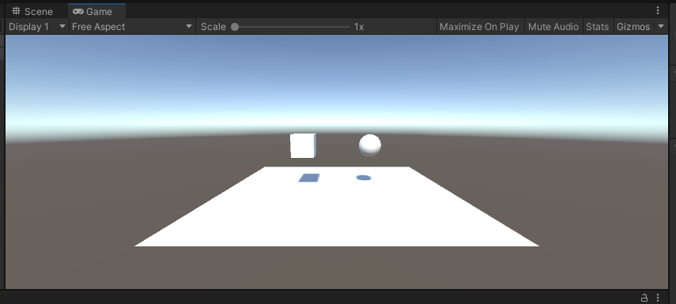
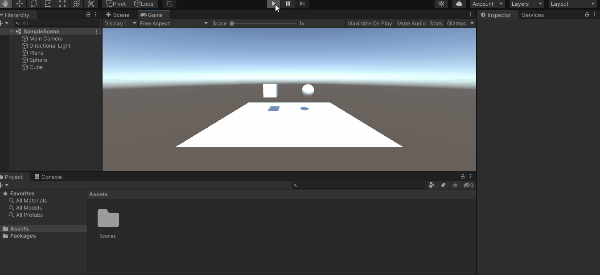
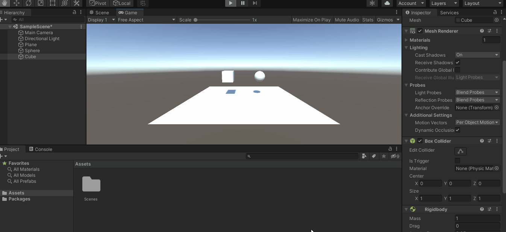
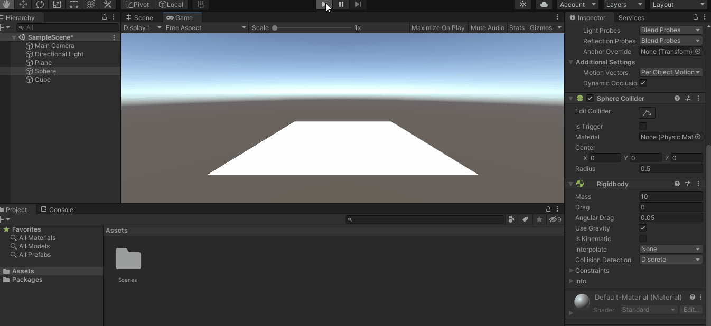
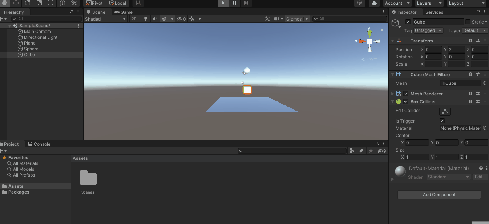
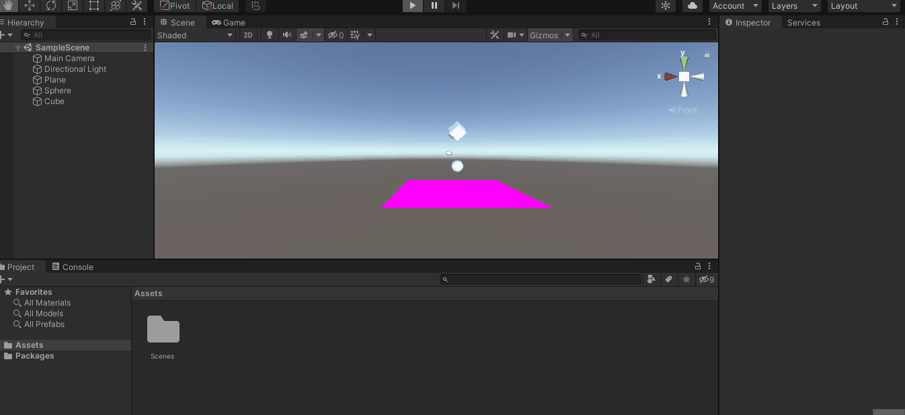
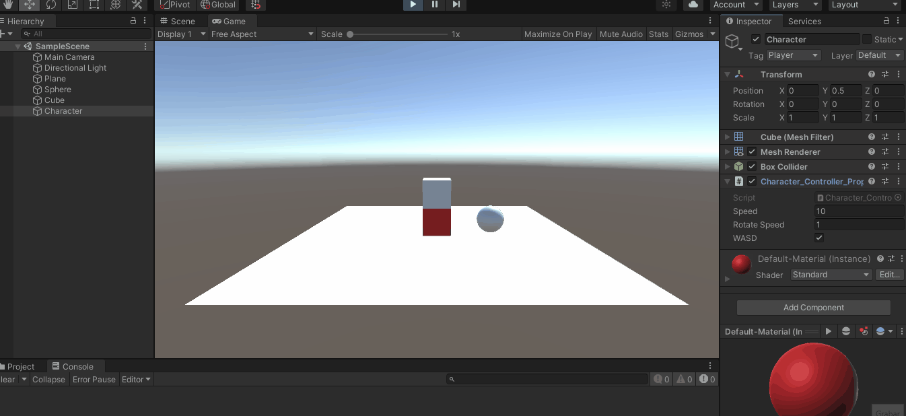

# **Práctica 2 de Interfaces Inteligentes**
## **Autor**: Francisco Jesus Mendes Gomez

## **Índice:**  

1. [**Apartado 1**](#id1)
2. [**Apartado 2**](#id2)  
3. [**Apartado 3**](#id3) 

<div name="id1" />

## Apartado 1
a. Ninguno de los objetos será físico.
  

Los dos objetos se quedan estáticos al ejecutar.  

b. La esfera tiene físicas y el cubo no.
  

El cubo se queda estático y la esfera tine gravedad y colisiona con el plano.  

c. La esfera y el cubo tienen físicas.
  

A ambos les afecta la gravedad y colisionan con el plano.  

d. La esfera y el cubo son físicos y la esfera tiene 10 veces la masa del cubo.
  

A pesar de que la esfera tiene más masa no se observa en el resultado ya que la masa no afecta a la velocidad con la que cae un objeto por acción de la gravedad.  

e. La esfera tiene físicas y el cubo es de tipo IsTrigger.
  

Como observamos solo la esfera es afectada por la gravedad pero el cubo no además de que el cubo es intangible ya que la esfera colisiona pero pasa através de él.  

f. La esfera tiene físicas, el cubo es de tipo IsTrigger y tiene físicas.
  

En este caso ambos son afectados por la gravedad pero el cubo no es tangible por lo que no colisiona con el plano y pasa a través de él.

g. La esfera y el cubo son físicos y la esfera tiene 10 veces la masa del cubo, se impide la rotación del cubo sobre el plano XZ.
  

Como observamos el movimiento que observamos en el cubo no son los que habitualmente tendría ya que no tiene rotación en el plano XZ quedando ligeramente levantado sobre el plano después de haber colisionado. 


<div name="id2" />

## Apartado 2

Resultado:  
 

Observamos como podemos mover y rotar el cubo rojo ya sea con las flechas o con el WASD y rotar sobre su eje OY con las teclas 'z'(antihorario) y 'x'(horario). Así como cambiar los parámetros para cambiar entre flechas y wasd, la velocidad de movimiento y la velocidad de rotación.

Todo esto gracias al siguiente script añadido la objeto cubo.  
```c#
using System.Collections;
using System.Collections.Generic;
using UnityEngine;

public class Character_Controller_Propia : MonoBehaviour
{
    public float speed = 10.0f; // Velocidad de movimiento
    public float rotateSpeed = 20.0f;// Velocidad de rotación
    GameObject player; // Referencia a player.
    public bool WASD = true; // Switch para usar las flechas o el WASD.
    // Start is called before the first frame update
    void Start()
    {
        player = GameObject.FindWithTag("Player");
        //Cambiar de color el cubo a rojo para distinguirlo
        player.GetComponent<Renderer>().material.color = Color.red;
    }

    // Update is called once per frame
    void Update()
    {
        //Movimiento sobre el plano XZ
        Transform tf = player.GetComponent<Transform>();
        if (WASD){
            if (Input.GetKey(KeyCode.W))
            {
                tf.Translate(Vector3.forward * speed * Time.deltaTime,  Space.Self);
                Debug.Log(tf.position);
            }
            if (Input.GetKey(KeyCode.A))
            {
                tf.Translate(Vector3.left * speed * Time.deltaTime,  Space.Self);
                Debug.Log(tf.position);
            }
            if (Input.GetKey(KeyCode.S))
            {
                tf.Translate(Vector3.back * speed * Time.deltaTime,  Space.Self);
                Debug.Log(tf.position);
            }
            if (Input.GetKey(KeyCode.D))
            {
                tf.Translate(Vector3.right * speed * Time.deltaTime,  Space.Self);
                Debug.Log(tf.position);
            }
        }
        else 
        {
            if (Input.GetKey("up"))
            {
                tf.Translate(Vector3.forward * speed * Time.deltaTime,  Space.Self);
                Debug.Log(tf.position);
            }
            if (Input.GetKey("left"))
            {
                tf.Translate(Vector3.left * speed * Time.deltaTime,  Space.Self);
                Debug.Log(tf.position);
            }
            if (Input.GetKey("down"))
            {
                tf.Translate(Vector3.back * speed * Time.deltaTime,  Space.Self);
                Debug.Log(tf.position);
            }
            if (Input.GetKey("right"))
            {
                tf.Translate(Vector3.right * speed * Time.deltaTime,  Space.Self);
                Debug.Log(tf.position);
            }
        }
        //Rotación
        float rotation = Input.GetAxis("Y") * rotateSpeed;
        rotation *= Time.deltaTime;
        tf.Rotate(0, rotation, 0);
    }
}

```
<div name="id3" />

